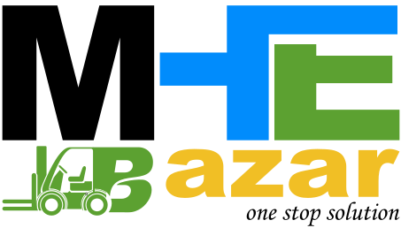

# MHE Bazar - Material Handling Equipment Marketplace



**MHE Bazar** is a comprehensive e-commerce platform for Material Handling Equipment (MHE) in India, serving as a marketplace for forklifts, pallet trucks, stackers, reach trucks, and related equipment. The platform offers sales, rentals, spare parts, and services for industrial businesses.

## 🚀 Technology Stack

- **Framework**: Next.js 15.3.4 with App Router
- **Language**: TypeScript 5.x (Strict mode)
- **Styling**: Tailwind CSS 4.x with shadcn/ui components
- **State Management**: React Hook Form for forms
- **Animation**: Framer Motion 12.x
- **Build Tool**: Turbopack for faster development
- **Package Manager**: npm

## 🏗️ Project Structure

```
src/
├── app/                    # Next.js App Router pages
│   ├── [category]/        # Dynamic category pages
│   ├── product/           # Product pages
│   ├── vendor-listing/    # Vendor pages
│   └── layout.tsx         # Root layout
├── components/
│   ├── elements/          # Reusable UI elements
│   ├── forms/             # Form components
│   ├── home/              # Homepage sections
│   ├── layout/            # Layout components
│   ├── products/          # Product-related components
│   ├── ui/                # shadcn/ui components
│   └── vendor-listing/    # Vendor components
├── lib/
│   ├── api.ts             # API utilities with error handling
│   └── utils.ts           # Utility functions
└── types/
    └── index.ts           # TypeScript type definitions
```

## 🛠️ Getting Started

### Prerequisites

- Node.js 18.18.0+ or 20.0.0+
- npm (comes with Node.js)

### Installation

1. Clone the repository:
```bash
git clone <repository-url>
cd mhebazar
```

2. Install dependencies:
```bash
npm install
```

3. Set up environment variables:
```bash
cp .env.example .env.local
# Edit .env.local with your configuration
```

4. Run the development server:
```bash
npm run dev
```

Open [http://localhost:3000](http://localhost:3000) to see the application.

## 📝 Available Scripts

- `npm run dev` - Start development server with Turbopack
- `npm run build` - Build the application for production
- `npm run start` - Start the production server
- `npm run lint` - Run ESLint for code quality

## 🎯 Key Features

### Business Features
- **Product Catalog**: Support for MHE categories, subcategories, and filters
- **Multi-vendor Marketplace**: Vendor registration and product management
- **Rental & Purchase Options**: Clear distinction for equipment rental vs purchase
- **Inquiry System**: Quote requests and rental inquiries
- **Spare Parts Catalog**: Parts compatibility with equipment
- **Service Requests**: Maintenance and repair scheduling

### Technical Features
- **TypeScript Safety**: Strict typing with explicit return types
- **Responsive Design**: Mobile-first approach with Tailwind CSS
- **SEO Optimized**: Dynamic meta tags and structured data
- **Performance**: Optimized images with Next.js Image component
- **Accessibility**: WCAG 2.1 compliance with proper ARIA labels
- **Error Handling**: Comprehensive error boundaries and API error handling

## 🔧 Development Guidelines

### Code Standards
- **TypeScript**: Strict mode enabled, no `any` types
- **Components**: Functional components with hooks, PascalCase naming
- **Styling**: Tailwind CSS utilities, use `cn()` for conditional classes
- **Import Order**: React/Next.js → Third-party → Internal components → Types

### Component Structure
```typescript
// 1. Imports
import React from "react";
import { ComponentProps } from "@/types";

// 2. Interfaces
interface Props {
  title: string;
  onClick: () => void;
}

// 3. Component
export default function Component({ title, onClick }: Props): JSX.Element {
  return (
    <button onClick={onClick}>{title}</button>
  );
}
```

## 🎨 UI/UX Standards

- **Design System**: Green primary (#16a34a), shadcn/ui components
- **Typography**: Geist Sans (primary), Geist Mono (code)
- **Icons**: Lucide React
- **Animations**: Framer Motion for interactions
- **Touch Targets**: Minimum 44px for mobile accessibility

## 📱 Mobile Considerations

- **Mobile-first Design**: All components responsive
- **Touch Interactions**: Swipe gestures for carousels
- **Performance**: Optimized for slower mobile connections
- **B2B Focus**: Designed for business users on mobile devices

## 🔒 Security & Best Practices

- **Input Validation**: All inputs sanitized and validated
- **Error Handling**: Graceful error boundaries and user-friendly messages
- **Type Safety**: Comprehensive TypeScript coverage
- **Performance**: Core Web Vitals optimization (LCP < 2.5s, FID < 100ms, CLS < 0.1)

## 📦 Environment Configuration

Key environment variables (see `.env.example` for complete list):

```env
NEXT_PUBLIC_API_BASE_URL=http://localhost:8000/api
NEXT_PUBLIC_APP_URL=http://localhost:3000
NEXT_PUBLIC_CONTACT_PHONE=+91 97456 81234
NEXT_PUBLIC_CONTACT_EMAIL=info@mhebazar.com
```

## 🚀 Deployment

### Vercel (Recommended)
1. Connect your repository to Vercel
2. Configure environment variables
3. Deploy automatically on git push

### Other Platforms
1. Build the application: `npm run build`
2. Start the server: `npm run start`
3. Ensure environment variables are configured

## 🤖 AI Development Integration

This project includes a comprehensive `Rules` file for AI assistance:
- Business domain knowledge (MHE equipment)
- Technical architecture guidelines
- TypeScript best practices
- Component patterns and conventions
- Performance and accessibility standards

## 📞 Support

- **Business Inquiries**: info@mhebazar.com
- **Technical Support**: +91 97456 81234
- **Documentation**: See `Rules` file for detailed guidelines

## 🤝 Contributing

1. Follow the TypeScript and component guidelines in the `Rules` file
2. Ensure all components have proper types and return types
3. Test responsive design on mobile devices
4. Maintain accessibility standards
5. Add appropriate error handling

---

**MHE Bazar** - Empowering India's Material Handling Equipment Industry
